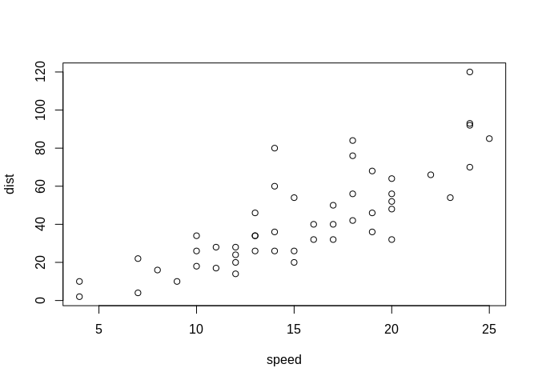
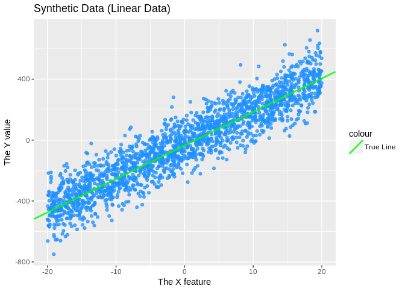
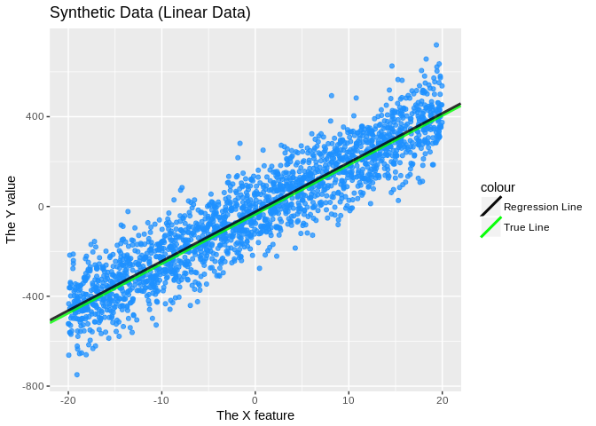
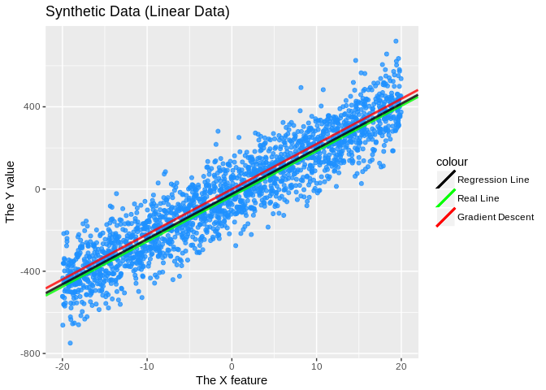
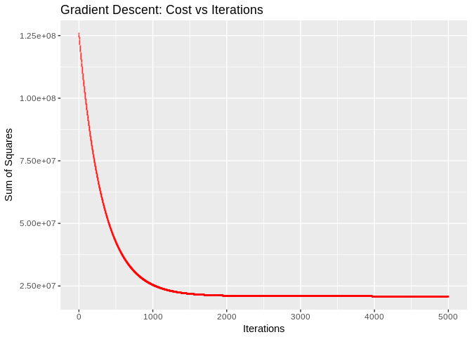
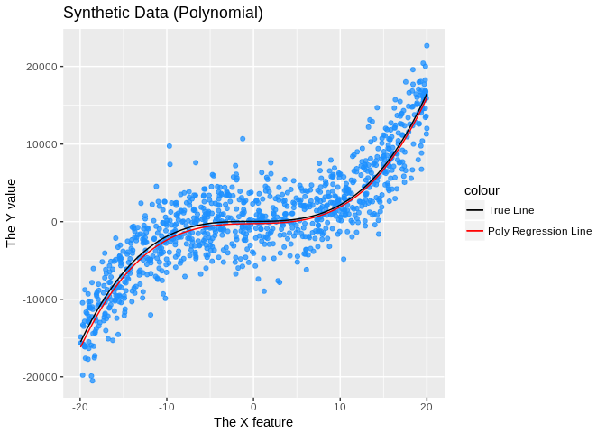
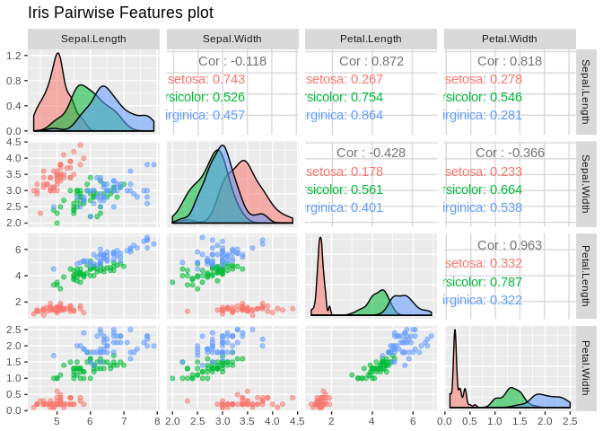
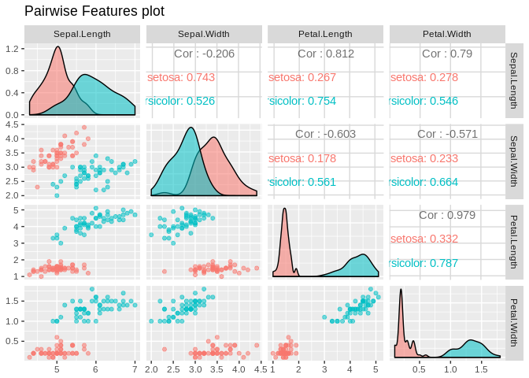
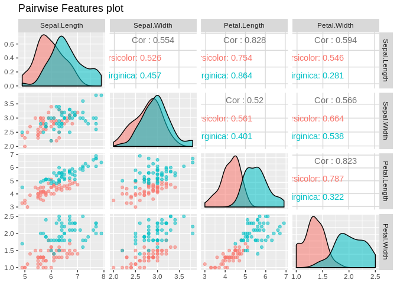

EDA-MOD-Assessment
================
Adriel Martinez (<adriel.martinez@mail.utoronto.ca>)

NOTE: If you want to go through this notebook, clear all the code output. Click the gear icon beside preview and click *Clear All Output*

How to use Rmarkdown
--------------------

This is an [R Markdown](http://rmarkdown.rstudio.com) Notebook. When you execute code within the notebook, the results appear beneath the code.

Try executing this chunk by clicking the *Run* button within the chunk or by placing your cursor inside it and pressing *Ctrl+Shift+Enter*.

``` r
plot(cars)
```



Some prep
---------

We will be using a couple of libraries.

``` r
if (!require(ggplot2, quietly=TRUE)) {
  install.packages("ggplot2")
  library(ggplot2)
}

if (!require(GGally, quietly=TRUE)) {
  install.packages("GGally")
  library(GGally)
}
```

Some cost functions will be used

``` r
sumOfSquaresCost <- function(x, y, theta) {
  X <- matrix(c(1), ncol=length(x))
  X <- rbind(X, x)
  return(sum((y - (t(theta) %*% X)) ^ 2))
}

sumOfSquaresGrad <- function(x, y, theta) {
  X <- matrix(c(1), ncol=length(x))
  X <- rbind(X, x)
  tmp <- y - (t(theta) %*% X)
  rowWise <- sweep(X,MARGIN=2, tmp,`*`)
  return(-2 * matrix(rowSums(rowWise)))
}

sigmoidFunction <- function(x) {
  return(1/(1 + exp(-x)))
}

logisticCost <- function(x, y, theta) {
  X <- matrix(c(1), ncol=length(x))
  X <- rbind(X, x)
  h <- sapply(t(theta) %*% X, sigmoidFunction)
  totalCost <- 0
  for (i in 1:length(h)) {
    elementCost <- -(y[i] * log(h[i])) - ((1 - y) * log(1 - h[i]))
    totalCost <- totalCost + elementCost
  }
  return(totalCost)
}

logisticCostGrad <- function(x, y, theta) {
  X <- matrix(c(1), ncol=length(x))
  X <- rbind(X, x)
  h <- sapply(t(theta) %*% X, sigmoidFunction)
  tmp <- h - y
  rowWise <- sweep(X,MARGIN=2, tmp,`*`)
  return(matrix(rowSums(rowWise)))
}

polySumOfSquaresCost <- function(x, y, genFunction) {
  return(sum((y - sapply(x, genFunction)) ^ 2))
}
```

I guess gradient descent will be used as well.

``` r
gradDescent <- function(x, y, theta, costFun, costGrad, alpha, maxIter, verbose=FALSE) {
  cost <- c(length=maxIter + 1)
  cost[1] <- costFun(x, y, theta)
  iter <- 0
  while (iter < maxIter) {
    theta <- theta - (alpha * costGrad(x, y, theta))
    iterCost <- costFun(x, y, theta)
    cost[iter + 2] <- iterCost
    if (verbose) {
      print(sprintf("Iter: %f/%f, Cost: %f", iter + 1, maxIter, iterCost))
    }
    iter <- iter + 1
  }
  return(list("theta"=theta, "cost"=cost))
}
```

Linear Data Regression
----------------------

### Generate some data

We will be generating data around the line y = 22x - 35

``` r
linearTheta <- matrix(c(-35, 22))
dataSize <- 2000
# Don't forget that seed
set.seed(123)
# Generate the x values between -20 and 20
linearX <- runif(dataSize, min=-20, max=20)
# To generate y, we need to append a row of 1's for the intercept
linearM <- matrix(c(1), ncol=length(linearX))
linearM <- rbind(linearM, linearX)
# The actual generation. Do matrix multiplication to generate the line values then add normal noise
linearY <- c(t(linearTheta) %*% linearM + rnorm(length(linearX), mean=10, sd=100))
```

Let's see the generated data.

``` r
# Store in a data frame so we can plot it
linearDf <- data.frame(x=linearX, y=linearY)
linearPlot <- ggplot(linearDf, aes(x, y)) +
  geom_point(colour="dodgerblue",alpha=0.75) +
  geom_abline(aes(colour="green", intercept=linearTheta[1], slope=linearTheta[2]), alpha=0.8, size=1) +
  scale_color_identity(labels=c("True Line"), guide="legend") +
  ggtitle("Synthetic Data (Linear Data)") +
  labs(y="The Y value", x = "The X feature")
linearPlot
```



### The actual Linear Regression

Fitting a regression line is as *easy* as running `lm()`.

``` r
linearDataRegression <- lm(linearY ~ linearX)
linearDataRegression
```

    ## 
    ## Call:
    ## lm(formula = linearY ~ linearX)
    ## 
    ## Coefficients:
    ## (Intercept)      linearX  
    ##      -23.89        21.96

Pretty close to the true line.

``` r
linearPlot <- linearPlot +
  geom_abline(aes(colour="black", intercept=linearDataRegression$coefficients[1], slope=linearDataRegression$coefficients[2]), alpha=0.8, size=1) +
  scale_color_identity(labels=c("Regression Line", "True Line"), guide="legend")
linearPlot
```



Let's try using gradient descent. The code is available in the **Some Prep** section.

``` r
initTheta <- matrix(c(1, 2))
gradResults <- gradDescent(linearX, linearY, initTheta, sumOfSquaresCost, sumOfSquaresGrad, 3E-9, 5000)
gradResults$theta
```

    ##            [,1]
    ## [1,] -0.4620505
    ## [2,] 21.9700690

Again pretty close. Plot it as well.

``` r
linearPlot <- linearPlot +
  geom_abline(aes(colour="red", intercept=gradResults$theta[1], slope=gradResults$theta[2]), alpha=0.8, size=1) +
  scale_color_identity(labels=c("Regression Line", "Real Line", "Gradient Descent"), guide="legend")
linearPlot
```



Let's see those learning (cost) curves.

``` r
gradDf <- data.frame(iter=1:length(gradResults$cost), cost=gradResults$cost)
costP <- ggplot(gradDf, aes(iter, cost)) +
  geom_point(colour="red",alpha=0.75, shape=42) +
  ggtitle("Gradient Descent: Cost vs Iterations") +
  labs(y="Sum of Squares", x = "Iterations")
costP
```



That's a smooth descent!

### Some metrics analysis

Let's look at the sum of squares error and mean squared error.

``` r
# Real line
sumOfSquaresCost(linearX, linearY, linearTheta)
```

    ## [1] 20013270

``` r
sumOfSquaresCost(linearX, linearY, linearTheta) / length(linearX)
```

    ## [1] 10006.64

``` r
# Built in R lm (Maximum likelihood estimator?)
mleTheta <- matrix(c(linearDataRegression$coefficients))
sumOfSquaresCost(linearX, linearY, mleTheta)
```

    ## [1] 19765678

``` r
sumOfSquaresCost(linearX, linearY, mleTheta) / length(linearX)
```

    ## [1] 9882.839

``` r
# Gradient Descent
sumOfSquaresCost(linearX, linearY, gradResults$theta)
```

    ## [1] 20862970

``` r
sumOfSquaresCost(linearX, linearY, gradResults$theta) / length(linearX)
```

    ## [1] 10431.48

The R lm algorithm did better than the real line. That's the power of randomness!

R includes some analysis in the regression model.

``` r
summary(linearDataRegression)
```

    ## 
    ## Call:
    ## lm(formula = linearY ~ linearX)
    ## 
    ## Residuals:
    ##     Min      1Q  Median      3Q     Max 
    ## -306.63  -66.68   -1.97   67.96  340.93 
    ## 
    ## Coefficients:
    ##             Estimate Std. Error t value Pr(>|t|)    
    ## (Intercept) -23.8858     2.2241  -10.74   <2e-16 ***
    ## linearX      21.9615     0.1941  113.14   <2e-16 ***
    ## ---
    ## Signif. codes:  0 '***' 0.001 '**' 0.01 '*' 0.05 '.' 0.1 ' ' 1
    ## 
    ## Residual standard error: 99.46 on 1998 degrees of freedom
    ## Multiple R-squared:  0.865,  Adjusted R-squared:  0.8649 
    ## F-statistic: 1.28e+04 on 1 and 1998 DF,  p-value: < 2.2e-16

Nonlinear Data Regression
-------------------------

### Generate some data

This time, we'll generate data points for y = 2x<sup>3</sup> - x<sup>2</sup> + 3x - 33

``` r
# First off, let's create a function that will create a function for a particular theta
genYFunction <- function(t) {
  genY <- function(x) {
    return((t[4] * (x ^ 3)) + (t[3] * (x ^ 2)) + (t[2] *  x) - t[1])
  }
  return(genY)
}

polyTheta <- matrix(c(-33, 3, 1, 2))
dataSize <- 1000
# Another. 10 because class starts at 10.
set.seed(10)
polyX <- runif(dataSize, min=-20, max=20)
realFunction <- genYFunction(polyTheta)
polyY <- sapply(polyX, realFunction) + rnorm(length(polyX), mean=32, sd=3000)
```

It should look fine? Let's plot it.

``` r
# Store in df to plot
polyDf <- data.frame(x=polyX, y=polyY)
polyP <- ggplot(polyDf, aes(x, y)) +
  geom_point(colour="dodgerblue",alpha=0.75) +
  stat_function(fun = realFunction, aes(colour = "black")) +
  scale_color_identity(labels=c("True Line"), guide="legend") +
  ggtitle("Synthetic Data (Polynomial)") +
  labs(y="The Y value", x = "The X feature")
polyP
```


### Regression

Now we regress. We still use `lm()`

``` r
# While we still use lm(), the parameters are different now
nonlinReg <- lm(polyY ~ polyX + I(polyX^2) + I(polyX^3))
nonlinReg
```

    ## 
    ## Call:
    ## lm(formula = polyY ~ polyX + I(polyX^2) + I(polyX^3))
    ## 
    ## Coefficients:
    ## (Intercept)        polyX   I(polyX^2)   I(polyX^3)  
    ##    251.5274      16.3791       0.1972       1.9764

``` r
polyFitFunction <- genYFunction(nonlinReg$coefficients)
polyP <- polyP +
  stat_function(fun = polyFitFunction, aes(colour = "red")) +
  scale_color_identity(labels=c("True Line", "Poly Regression Line"), guide="legend")
polyP
```



Pretty close? What if we thought the data was linear?

``` r
linReg <- lm(polyY ~ polyX)
linReg
```

    ## 
    ## Call:
    ## lm(formula = polyY ~ polyX)
    ## 
    ## Coefficients:
    ## (Intercept)        polyX  
    ##       362.7        495.0

``` r
polyP <- polyP +
  geom_abline(aes(colour="green", intercept=linReg$coefficients[1], slope=linReg$coefficients[2]), alpha=0.8, size=1) +
  scale_color_identity(labels=c("True Line", "Lin Regression Line", "Poly Regression Line"), guide="legend")
polyP
```


Well that doesn't look right.

### Some metrics analysis

Let's look at sum of squares and mean squared error.

``` r
# Real line
polySumOfSquaresCost(polyX, polyY, realFunction)
```

    ## [1] 9438712729

``` r
polySumOfSquaresCost(polyX, polyY, realFunction) / length(polyX)
```

    ## [1] 9438713

``` r
# Polynomial regression
polySumOfSquaresCost(polyX, polyY, polyFitFunction)
```

    ## [1] 9662225260

``` r
polySumOfSquaresCost(polyX, polyY, polyFitFunction) / length(polyX)
```

    ## [1] 9662225

``` r
# Linear regression
mleTheta <- matrix(c(linReg$coefficients))
sumOfSquaresCost(polyX, polyY, mleTheta)
```

    ## [1] 15374486098

``` r
sumOfSquaresCost(polyX, polyY, mleTheta) / length(polyX)
```

    ## [1] 15374486

This time, the estimated polynomial line didn't do as good as the real line. The linear line was not even close...

``` r
summary(nonlinReg)
```

    ## 
    ## Call:
    ## lm(formula = polyY ~ polyX + I(polyX^2) + I(polyX^3))
    ## 
    ## Residuals:
    ##     Min      1Q  Median      3Q     Max 
    ## -9238.2 -2025.8   -20.2  2148.5 11435.0 
    ## 
    ## Coefficients:
    ##              Estimate Std. Error t value Pr(>|t|)    
    ## (Intercept) 251.52741  147.05107   1.710   0.0875 .  
    ## polyX        16.37905   20.78989   0.788   0.4310    
    ## I(polyX^2)    0.19717    0.81033   0.243   0.8078    
    ## I(polyX^3)    1.97638    0.07871  25.109   <2e-16 ***
    ## ---
    ## Signif. codes:  0 '***' 0.001 '**' 0.01 '*' 0.05 '.' 0.1 ' ' 1
    ## 
    ## Residual standard error: 3074 on 996 degrees of freedom
    ## Multiple R-squared:  0.807,  Adjusted R-squared:  0.8065 
    ## F-statistic:  1389 on 3 and 996 DF,  p-value: < 2.2e-16

``` r
summary(linReg)
```

    ## 
    ## Call:
    ## lm(formula = polyY ~ polyX)
    ## 
    ## Residuals:
    ##    Min     1Q Median     3Q    Max 
    ## -11687  -2565   -145   2841  14181 
    ## 
    ## Coefficients:
    ##             Estimate Std. Error t value Pr(>|t|)    
    ## (Intercept)   362.67     124.14   2.922  0.00356 ** 
    ## polyX         494.99      10.63  46.556  < 2e-16 ***
    ## ---
    ## Signif. codes:  0 '***' 0.001 '**' 0.01 '*' 0.05 '.' 0.1 ' ' 1
    ## 
    ## Residual standard error: 3925 on 998 degrees of freedom
    ## Multiple R-squared:  0.6847, Adjusted R-squared:  0.6844 
    ## F-statistic:  2167 on 1 and 998 DF,  p-value: < 2.2e-16

Logistic Regression
-------------------

We will be doing logistic regression based on <http://michael.hahsler.net/SMU/EMIS7332/R/logistic_regression.html>

The data we will be using is the [Iris flower data set](https://en.wikipedia.org/wiki/Iris_flower_data_set) contains data about various flower features such as its sepal length, sepal width, petal length, and petal width. For every entry, each has those features along with the labelled species.

``` r
iris
```

    ##     Sepal.Length Sepal.Width Petal.Length Petal.Width    Species
    ## 1            5.1         3.5          1.4         0.2     setosa
    ## 2            4.9         3.0          1.4         0.2     setosa
    ## 3            4.7         3.2          1.3         0.2     setosa
    ## 4            4.6         3.1          1.5         0.2     setosa
    ## 5            5.0         3.6          1.4         0.2     setosa
    ## 6            5.4         3.9          1.7         0.4     setosa
    ## 7            4.6         3.4          1.4         0.3     setosa
    ## 8            5.0         3.4          1.5         0.2     setosa
    ## 9            4.4         2.9          1.4         0.2     setosa
    ## 10           4.9         3.1          1.5         0.1     setosa
    ## 11           5.4         3.7          1.5         0.2     setosa
    ## 12           4.8         3.4          1.6         0.2     setosa
    ## 13           4.8         3.0          1.4         0.1     setosa
    ## 14           4.3         3.0          1.1         0.1     setosa
    ## 15           5.8         4.0          1.2         0.2     setosa
    ## 16           5.7         4.4          1.5         0.4     setosa
    ## 17           5.4         3.9          1.3         0.4     setosa
    ## 18           5.1         3.5          1.4         0.3     setosa
    ## 19           5.7         3.8          1.7         0.3     setosa
    ## 20           5.1         3.8          1.5         0.3     setosa
    ## 21           5.4         3.4          1.7         0.2     setosa
    ## 22           5.1         3.7          1.5         0.4     setosa
    ## 23           4.6         3.6          1.0         0.2     setosa
    ## 24           5.1         3.3          1.7         0.5     setosa
    ## 25           4.8         3.4          1.9         0.2     setosa
    ## 26           5.0         3.0          1.6         0.2     setosa
    ## 27           5.0         3.4          1.6         0.4     setosa
    ## 28           5.2         3.5          1.5         0.2     setosa
    ## 29           5.2         3.4          1.4         0.2     setosa
    ## 30           4.7         3.2          1.6         0.2     setosa
    ## 31           4.8         3.1          1.6         0.2     setosa
    ## 32           5.4         3.4          1.5         0.4     setosa
    ## 33           5.2         4.1          1.5         0.1     setosa
    ## 34           5.5         4.2          1.4         0.2     setosa
    ## 35           4.9         3.1          1.5         0.2     setosa
    ## 36           5.0         3.2          1.2         0.2     setosa
    ## 37           5.5         3.5          1.3         0.2     setosa
    ## 38           4.9         3.6          1.4         0.1     setosa
    ## 39           4.4         3.0          1.3         0.2     setosa
    ## 40           5.1         3.4          1.5         0.2     setosa
    ## 41           5.0         3.5          1.3         0.3     setosa
    ## 42           4.5         2.3          1.3         0.3     setosa
    ## 43           4.4         3.2          1.3         0.2     setosa
    ## 44           5.0         3.5          1.6         0.6     setosa
    ## 45           5.1         3.8          1.9         0.4     setosa
    ## 46           4.8         3.0          1.4         0.3     setosa
    ## 47           5.1         3.8          1.6         0.2     setosa
    ## 48           4.6         3.2          1.4         0.2     setosa
    ## 49           5.3         3.7          1.5         0.2     setosa
    ## 50           5.0         3.3          1.4         0.2     setosa
    ## 51           7.0         3.2          4.7         1.4 versicolor
    ## 52           6.4         3.2          4.5         1.5 versicolor
    ## 53           6.9         3.1          4.9         1.5 versicolor
    ## 54           5.5         2.3          4.0         1.3 versicolor
    ## 55           6.5         2.8          4.6         1.5 versicolor
    ## 56           5.7         2.8          4.5         1.3 versicolor
    ## 57           6.3         3.3          4.7         1.6 versicolor
    ## 58           4.9         2.4          3.3         1.0 versicolor
    ## 59           6.6         2.9          4.6         1.3 versicolor
    ## 60           5.2         2.7          3.9         1.4 versicolor
    ## 61           5.0         2.0          3.5         1.0 versicolor
    ## 62           5.9         3.0          4.2         1.5 versicolor
    ## 63           6.0         2.2          4.0         1.0 versicolor
    ## 64           6.1         2.9          4.7         1.4 versicolor
    ## 65           5.6         2.9          3.6         1.3 versicolor
    ## 66           6.7         3.1          4.4         1.4 versicolor
    ## 67           5.6         3.0          4.5         1.5 versicolor
    ## 68           5.8         2.7          4.1         1.0 versicolor
    ## 69           6.2         2.2          4.5         1.5 versicolor
    ## 70           5.6         2.5          3.9         1.1 versicolor
    ## 71           5.9         3.2          4.8         1.8 versicolor
    ## 72           6.1         2.8          4.0         1.3 versicolor
    ## 73           6.3         2.5          4.9         1.5 versicolor
    ## 74           6.1         2.8          4.7         1.2 versicolor
    ## 75           6.4         2.9          4.3         1.3 versicolor
    ## 76           6.6         3.0          4.4         1.4 versicolor
    ## 77           6.8         2.8          4.8         1.4 versicolor
    ## 78           6.7         3.0          5.0         1.7 versicolor
    ## 79           6.0         2.9          4.5         1.5 versicolor
    ## 80           5.7         2.6          3.5         1.0 versicolor
    ## 81           5.5         2.4          3.8         1.1 versicolor
    ## 82           5.5         2.4          3.7         1.0 versicolor
    ## 83           5.8         2.7          3.9         1.2 versicolor
    ## 84           6.0         2.7          5.1         1.6 versicolor
    ## 85           5.4         3.0          4.5         1.5 versicolor
    ## 86           6.0         3.4          4.5         1.6 versicolor
    ## 87           6.7         3.1          4.7         1.5 versicolor
    ## 88           6.3         2.3          4.4         1.3 versicolor
    ## 89           5.6         3.0          4.1         1.3 versicolor
    ## 90           5.5         2.5          4.0         1.3 versicolor
    ## 91           5.5         2.6          4.4         1.2 versicolor
    ## 92           6.1         3.0          4.6         1.4 versicolor
    ## 93           5.8         2.6          4.0         1.2 versicolor
    ## 94           5.0         2.3          3.3         1.0 versicolor
    ## 95           5.6         2.7          4.2         1.3 versicolor
    ## 96           5.7         3.0          4.2         1.2 versicolor
    ## 97           5.7         2.9          4.2         1.3 versicolor
    ## 98           6.2         2.9          4.3         1.3 versicolor
    ## 99           5.1         2.5          3.0         1.1 versicolor
    ## 100          5.7         2.8          4.1         1.3 versicolor
    ## 101          6.3         3.3          6.0         2.5  virginica
    ## 102          5.8         2.7          5.1         1.9  virginica
    ## 103          7.1         3.0          5.9         2.1  virginica
    ## 104          6.3         2.9          5.6         1.8  virginica
    ## 105          6.5         3.0          5.8         2.2  virginica
    ## 106          7.6         3.0          6.6         2.1  virginica
    ## 107          4.9         2.5          4.5         1.7  virginica
    ## 108          7.3         2.9          6.3         1.8  virginica
    ## 109          6.7         2.5          5.8         1.8  virginica
    ## 110          7.2         3.6          6.1         2.5  virginica
    ## 111          6.5         3.2          5.1         2.0  virginica
    ## 112          6.4         2.7          5.3         1.9  virginica
    ## 113          6.8         3.0          5.5         2.1  virginica
    ## 114          5.7         2.5          5.0         2.0  virginica
    ## 115          5.8         2.8          5.1         2.4  virginica
    ## 116          6.4         3.2          5.3         2.3  virginica
    ## 117          6.5         3.0          5.5         1.8  virginica
    ## 118          7.7         3.8          6.7         2.2  virginica
    ## 119          7.7         2.6          6.9         2.3  virginica
    ## 120          6.0         2.2          5.0         1.5  virginica
    ## 121          6.9         3.2          5.7         2.3  virginica
    ## 122          5.6         2.8          4.9         2.0  virginica
    ## 123          7.7         2.8          6.7         2.0  virginica
    ## 124          6.3         2.7          4.9         1.8  virginica
    ## 125          6.7         3.3          5.7         2.1  virginica
    ## 126          7.2         3.2          6.0         1.8  virginica
    ## 127          6.2         2.8          4.8         1.8  virginica
    ## 128          6.1         3.0          4.9         1.8  virginica
    ## 129          6.4         2.8          5.6         2.1  virginica
    ## 130          7.2         3.0          5.8         1.6  virginica
    ## 131          7.4         2.8          6.1         1.9  virginica
    ## 132          7.9         3.8          6.4         2.0  virginica
    ## 133          6.4         2.8          5.6         2.2  virginica
    ## 134          6.3         2.8          5.1         1.5  virginica
    ## 135          6.1         2.6          5.6         1.4  virginica
    ## 136          7.7         3.0          6.1         2.3  virginica
    ## 137          6.3         3.4          5.6         2.4  virginica
    ## 138          6.4         3.1          5.5         1.8  virginica
    ## 139          6.0         3.0          4.8         1.8  virginica
    ## 140          6.9         3.1          5.4         2.1  virginica
    ## 141          6.7         3.1          5.6         2.4  virginica
    ## 142          6.9         3.1          5.1         2.3  virginica
    ## 143          5.8         2.7          5.1         1.9  virginica
    ## 144          6.8         3.2          5.9         2.3  virginica
    ## 145          6.7         3.3          5.7         2.5  virginica
    ## 146          6.7         3.0          5.2         2.3  virginica
    ## 147          6.3         2.5          5.0         1.9  virginica
    ## 148          6.5         3.0          5.2         2.0  virginica
    ## 149          6.2         3.4          5.4         2.3  virginica
    ## 150          5.9         3.0          5.1         1.8  virginica

``` r
ggpairs(iris, aes(colour = Species, alpha = 0.4), columns = 1:4, title = "Iris Pairwise Features plot")
```



### Some preprocessing

We will have to do some preprocessing to filter out the dataset, convert labels into 0 and 1, and generate train (the set where we do logistic regression on) and test (set to measure performance). We will be filtering out for the classes setosa and versicolor.

``` r
# Filter for desired classes
onlySetosa = iris[iris$Species == "setosa", ]
onlyVersicolor = iris[iris$Species == "versicolor", ]
# Create train and test 75/25 split
# Surprise, another seed
set.seed(410)
setosaSplit <- sample.int(n = nrow(onlySetosa), size = floor(0.75 * nrow(onlySetosa)), replace = F)
versicolorSplit <- sample.int(n = nrow(onlyVersicolor), size = floor(0.75 * nrow(onlyVersicolor)), replace = F)
trainSetosa <- onlySetosa[setosaSplit,]
trainVersicolor <- onlyVersicolor[versicolorSplit, ]
testSetosa <- onlySetosa[-setosaSplit, ]
testVersicolor <- onlyVersicolor[-versicolorSplit, ]
irisTrain <- rbind(trainSetosa, trainVersicolor)
irisTest <- rbind(testSetosa, testVersicolor)
# Fix up the metadata since we're skipping a class
irisTrain$Species <- factor(irisTrain$Species)
irisTest$Species <- factor(irisTest$Species)
irisTrain
```

    ##    Sepal.Length Sepal.Width Petal.Length Petal.Width    Species
    ## 32          5.4         3.4          1.5         0.4     setosa
    ## 13          4.8         3.0          1.4         0.1     setosa
    ## 26          5.0         3.0          1.6         0.2     setosa
    ## 6           5.4         3.9          1.7         0.4     setosa
    ## 17          5.4         3.9          1.3         0.4     setosa
    ## 29          5.2         3.4          1.4         0.2     setosa
    ## 34          5.5         4.2          1.4         0.2     setosa
    ## 31          4.8         3.1          1.6         0.2     setosa
    ## 33          5.2         4.1          1.5         0.1     setosa
    ## 46          4.8         3.0          1.4         0.3     setosa
    ## 19          5.7         3.8          1.7         0.3     setosa
    ## 2           4.9         3.0          1.4         0.2     setosa
    ## 24          5.1         3.3          1.7         0.5     setosa
    ## 42          4.5         2.3          1.3         0.3     setosa
    ## 49          5.3         3.7          1.5         0.2     setosa
    ## 4           4.6         3.1          1.5         0.2     setosa
    ## 45          5.1         3.8          1.9         0.4     setosa
    ## 28          5.2         3.5          1.5         0.2     setosa
    ## 30          4.7         3.2          1.6         0.2     setosa
    ## 38          4.9         3.6          1.4         0.1     setosa
    ## 47          5.1         3.8          1.6         0.2     setosa
    ## 16          5.7         4.4          1.5         0.4     setosa
    ## 9           4.4         2.9          1.4         0.2     setosa
    ## 48          4.6         3.2          1.4         0.2     setosa
    ## 50          5.0         3.3          1.4         0.2     setosa
    ## 25          4.8         3.4          1.9         0.2     setosa
    ## 11          5.4         3.7          1.5         0.2     setosa
    ## 35          4.9         3.1          1.5         0.2     setosa
    ## 15          5.8         4.0          1.2         0.2     setosa
    ## 10          4.9         3.1          1.5         0.1     setosa
    ## 39          4.4         3.0          1.3         0.2     setosa
    ## 14          4.3         3.0          1.1         0.1     setosa
    ## 3           4.7         3.2          1.3         0.2     setosa
    ## 22          5.1         3.7          1.5         0.4     setosa
    ## 20          5.1         3.8          1.5         0.3     setosa
    ## 43          4.4         3.2          1.3         0.2     setosa
    ## 21          5.4         3.4          1.7         0.2     setosa
    ## 95          5.6         2.7          4.2         1.3 versicolor
    ## 94          5.0         2.3          3.3         1.0 versicolor
    ## 82          5.5         2.4          3.7         1.0 versicolor
    ## 54          5.5         2.3          4.0         1.3 versicolor
    ## 99          5.1         2.5          3.0         1.1 versicolor
    ## 52          6.4         3.2          4.5         1.5 versicolor
    ## 85          5.4         3.0          4.5         1.5 versicolor
    ## 91          5.5         2.6          4.4         1.2 versicolor
    ## 69          6.2         2.2          4.5         1.5 versicolor
    ## 51          7.0         3.2          4.7         1.4 versicolor
    ## 70          5.6         2.5          3.9         1.1 versicolor
    ## 56          5.7         2.8          4.5         1.3 versicolor
    ## 72          6.1         2.8          4.0         1.3 versicolor
    ## 79          6.0         2.9          4.5         1.5 versicolor
    ## 64          6.1         2.9          4.7         1.4 versicolor
    ## 88          6.3         2.3          4.4         1.3 versicolor
    ## 55          6.5         2.8          4.6         1.5 versicolor
    ## 75          6.4         2.9          4.3         1.3 versicolor
    ## 77          6.8         2.8          4.8         1.4 versicolor
    ## 67          5.6         3.0          4.5         1.5 versicolor
    ## 60          5.2         2.7          3.9         1.4 versicolor
    ## 63          6.0         2.2          4.0         1.0 versicolor
    ## 89          5.6         3.0          4.1         1.3 versicolor
    ## 74          6.1         2.8          4.7         1.2 versicolor
    ## 73          6.3         2.5          4.9         1.5 versicolor
    ## 84          6.0         2.7          5.1         1.6 versicolor
    ## 68          5.8         2.7          4.1         1.0 versicolor
    ## 96          5.7         3.0          4.2         1.2 versicolor
    ## 98          6.2         2.9          4.3         1.3 versicolor
    ## 58          4.9         2.4          3.3         1.0 versicolor
    ## 78          6.7         3.0          5.0         1.7 versicolor
    ## 93          5.8         2.6          4.0         1.2 versicolor
    ## 86          6.0         3.4          4.5         1.6 versicolor
    ## 83          5.8         2.7          3.9         1.2 versicolor
    ## 57          6.3         3.3          4.7         1.6 versicolor
    ## 76          6.6         3.0          4.4         1.4 versicolor
    ## 66          6.7         3.1          4.4         1.4 versicolor

``` r
irisTest
```

    ##     Sepal.Length Sepal.Width Petal.Length Petal.Width    Species
    ## 1            5.1         3.5          1.4         0.2     setosa
    ## 5            5.0         3.6          1.4         0.2     setosa
    ## 7            4.6         3.4          1.4         0.3     setosa
    ## 8            5.0         3.4          1.5         0.2     setosa
    ## 12           4.8         3.4          1.6         0.2     setosa
    ## 18           5.1         3.5          1.4         0.3     setosa
    ## 23           4.6         3.6          1.0         0.2     setosa
    ## 27           5.0         3.4          1.6         0.4     setosa
    ## 36           5.0         3.2          1.2         0.2     setosa
    ## 37           5.5         3.5          1.3         0.2     setosa
    ## 40           5.1         3.4          1.5         0.2     setosa
    ## 41           5.0         3.5          1.3         0.3     setosa
    ## 44           5.0         3.5          1.6         0.6     setosa
    ## 53           6.9         3.1          4.9         1.5 versicolor
    ## 59           6.6         2.9          4.6         1.3 versicolor
    ## 61           5.0         2.0          3.5         1.0 versicolor
    ## 62           5.9         3.0          4.2         1.5 versicolor
    ## 65           5.6         2.9          3.6         1.3 versicolor
    ## 71           5.9         3.2          4.8         1.8 versicolor
    ## 80           5.7         2.6          3.5         1.0 versicolor
    ## 81           5.5         2.4          3.8         1.1 versicolor
    ## 87           6.7         3.1          4.7         1.5 versicolor
    ## 90           5.5         2.5          4.0         1.3 versicolor
    ## 92           6.1         3.0          4.6         1.4 versicolor
    ## 97           5.7         2.9          4.2         1.3 versicolor
    ## 100          5.7         2.8          4.1         1.3 versicolor

### Pre Logistic regression

Let's try plotting the data on a 2d plot between all the combinations of features.

``` r
filteredDataset <- rbind(onlySetosa, onlyVersicolor)
ggpairs(filteredDataset, aes(colour = Species, alpha = 0.4), columns = 1:4, title = "Pairwise Features plot")
```



The dataset is nicely segregated. Just choosing any pairwise feature for logistic regression is suffice. Might as well do logistic regression on all the features then.

### The actual logistic regression

Performing logistic regression in R is pretty simple. Just use the `glm()` function.

``` r
irisRegression <- glm(formula=Species ~ Sepal.Length + Sepal.Width + Petal.Length + Petal.Width, family=binomial, data=irisTrain)
```

Let's see how well it did on train and test groups.

``` r
# Train
irisTrainPrediciton <- predict(irisRegression, irisTrain, type="response")
table(actual=irisTrain$Species, predicted=irisTrainPrediciton>.5)
```

    ##             predicted
    ## actual       FALSE TRUE
    ##   setosa        37    0
    ##   versicolor     0   37

``` r
# Test
irisTestPrediction <- predict(irisRegression, irisTest, type="response")
table(actual=irisTest$Species, predicted=irisTestPrediction>.5)
```

    ##             predicted
    ## actual       FALSE TRUE
    ##   setosa        13    0
    ##   versicolor     0   13

Well that was an easy 100%. Judging from the pairwise plot for setosa and versicolor, I guess the results do make sense since it's so segregated. Now let's try versicolor and virginica.

``` r
onlyVirginica = iris[iris$Species == "virginica", ]
# Same deal with train and test
set.seed(410)
versicolorSplit <- sample.int(n = nrow(onlyVersicolor), size = floor(0.75 * nrow(onlyVersicolor)), replace = F)
virginicaSplit <- sample.int(n = nrow(onlyVirginica), size = floor(0.75 * nrow(onlyVirginica)), replace = F)
trainVersicolor <- onlyVersicolor[versicolorSplit, ]
trainVirginica <- onlyVirginica[virginicaSplit,]
testVersicolor <- onlyVersicolor[-versicolorSplit, ]
testVirginica <- onlyVirginica[-virginicaSplit, ]
irisTrain <- rbind(trainVersicolor, trainVirginica)
irisTest <- rbind(testVersicolor, testVirginica)
# Fix up the metadata since we're skipping a class
irisTrain$Species <- factor(irisTrain$Species)
irisTest$Species <- factor(irisTest$Species)
irisTrain
```

    ##     Sepal.Length Sepal.Width Petal.Length Petal.Width    Species
    ## 82           5.5         2.4          3.7         1.0 versicolor
    ## 63           6.0         2.2          4.0         1.0 versicolor
    ## 76           6.6         3.0          4.4         1.4 versicolor
    ## 56           5.7         2.8          4.5         1.3 versicolor
    ## 67           5.6         3.0          4.5         1.5 versicolor
    ## 79           6.0         2.9          4.5         1.5 versicolor
    ## 84           6.0         2.7          5.1         1.6 versicolor
    ## 81           5.5         2.4          3.8         1.1 versicolor
    ## 83           5.8         2.7          3.9         1.2 versicolor
    ## 96           5.7         3.0          4.2         1.2 versicolor
    ## 69           6.2         2.2          4.5         1.5 versicolor
    ## 52           6.4         3.2          4.5         1.5 versicolor
    ## 74           6.1         2.8          4.7         1.2 versicolor
    ## 92           6.1         3.0          4.6         1.4 versicolor
    ## 99           5.1         2.5          3.0         1.1 versicolor
    ## 54           5.5         2.3          4.0         1.3 versicolor
    ## 95           5.6         2.7          4.2         1.3 versicolor
    ## 78           6.7         3.0          5.0         1.7 versicolor
    ## 80           5.7         2.6          3.5         1.0 versicolor
    ## 88           6.3         2.3          4.4         1.3 versicolor
    ## 97           5.7         2.9          4.2         1.3 versicolor
    ## 66           6.7         3.1          4.4         1.4 versicolor
    ## 59           6.6         2.9          4.6         1.3 versicolor
    ## 98           6.2         2.9          4.3         1.3 versicolor
    ## 100          5.7         2.8          4.1         1.3 versicolor
    ## 75           6.4         2.9          4.3         1.3 versicolor
    ## 61           5.0         2.0          3.5         1.0 versicolor
    ## 85           5.4         3.0          4.5         1.5 versicolor
    ## 65           5.6         2.9          3.6         1.3 versicolor
    ## 60           5.2         2.7          3.9         1.4 versicolor
    ## 89           5.6         3.0          4.1         1.3 versicolor
    ## 64           6.1         2.9          4.7         1.4 versicolor
    ## 53           6.9         3.1          4.9         1.5 versicolor
    ## 72           6.1         2.8          4.0         1.3 versicolor
    ## 70           5.6         2.5          3.9         1.1 versicolor
    ## 93           5.8         2.6          4.0         1.2 versicolor
    ## 71           5.9         3.2          4.8         1.8 versicolor
    ## 145          6.7         3.3          5.7         2.5  virginica
    ## 144          6.8         3.2          5.9         2.3  virginica
    ## 132          7.9         3.8          6.4         2.0  virginica
    ## 104          6.3         2.9          5.6         1.8  virginica
    ## 149          6.2         3.4          5.4         2.3  virginica
    ## 102          5.8         2.7          5.1         1.9  virginica
    ## 135          6.1         2.6          5.6         1.4  virginica
    ## 141          6.7         3.1          5.6         2.4  virginica
    ## 119          7.7         2.6          6.9         2.3  virginica
    ## 101          6.3         3.3          6.0         2.5  virginica
    ## 120          6.0         2.2          5.0         1.5  virginica
    ## 106          7.6         3.0          6.6         2.1  virginica
    ## 122          5.6         2.8          4.9         2.0  virginica
    ## 129          6.4         2.8          5.6         2.1  virginica
    ## 114          5.7         2.5          5.0         2.0  virginica
    ## 138          6.4         3.1          5.5         1.8  virginica
    ## 105          6.5         3.0          5.8         2.2  virginica
    ## 125          6.7         3.3          5.7         2.1  virginica
    ## 127          6.2         2.8          4.8         1.8  virginica
    ## 117          6.5         3.0          5.5         1.8  virginica
    ## 110          7.2         3.6          6.1         2.5  virginica
    ## 113          6.8         3.0          5.5         2.1  virginica
    ## 139          6.0         3.0          4.8         1.8  virginica
    ## 124          6.3         2.7          4.9         1.8  virginica
    ## 123          7.7         2.8          6.7         2.0  virginica
    ## 134          6.3         2.8          5.1         1.5  virginica
    ## 118          7.7         3.8          6.7         2.2  virginica
    ## 146          6.7         3.0          5.2         2.3  virginica
    ## 148          6.5         3.0          5.2         2.0  virginica
    ## 108          7.3         2.9          6.3         1.8  virginica
    ## 128          6.1         3.0          4.9         1.8  virginica
    ## 143          5.8         2.7          5.1         1.9  virginica
    ## 136          7.7         3.0          6.1         2.3  virginica
    ## 133          6.4         2.8          5.6         2.2  virginica
    ## 107          4.9         2.5          4.5         1.7  virginica
    ## 126          7.2         3.2          6.0         1.8  virginica
    ## 116          6.4         3.2          5.3         2.3  virginica

``` r
irisTest
```

    ##     Sepal.Length Sepal.Width Petal.Length Petal.Width    Species
    ## 51           7.0         3.2          4.7         1.4 versicolor
    ## 55           6.5         2.8          4.6         1.5 versicolor
    ## 57           6.3         3.3          4.7         1.6 versicolor
    ## 58           4.9         2.4          3.3         1.0 versicolor
    ## 62           5.9         3.0          4.2         1.5 versicolor
    ## 68           5.8         2.7          4.1         1.0 versicolor
    ## 73           6.3         2.5          4.9         1.5 versicolor
    ## 77           6.8         2.8          4.8         1.4 versicolor
    ## 86           6.0         3.4          4.5         1.6 versicolor
    ## 87           6.7         3.1          4.7         1.5 versicolor
    ## 90           5.5         2.5          4.0         1.3 versicolor
    ## 91           5.5         2.6          4.4         1.2 versicolor
    ## 94           5.0         2.3          3.3         1.0 versicolor
    ## 103          7.1         3.0          5.9         2.1  virginica
    ## 109          6.7         2.5          5.8         1.8  virginica
    ## 111          6.5         3.2          5.1         2.0  virginica
    ## 112          6.4         2.7          5.3         1.9  virginica
    ## 115          5.8         2.8          5.1         2.4  virginica
    ## 121          6.9         3.2          5.7         2.3  virginica
    ## 130          7.2         3.0          5.8         1.6  virginica
    ## 131          7.4         2.8          6.1         1.9  virginica
    ## 137          6.3         3.4          5.6         2.4  virginica
    ## 140          6.9         3.1          5.4         2.1  virginica
    ## 142          6.9         3.1          5.1         2.3  virginica
    ## 147          6.3         2.5          5.0         1.9  virginica
    ## 150          5.9         3.0          5.1         1.8  virginica

Do another pairwise plot

``` r
filteredDataset <- rbind(onlyVersicolor, onlyVirginica)
ggpairs(filteredDataset, aes(colour = Species, alpha = 0.4), columns = 1:4, title = "Pairwise Features plot")
```



Hmm, still nicely segregated.

``` r
irisRegression <- glm(formula=Species ~ Sepal.Length + Sepal.Width + Petal.Length + Petal.Width, family=binomial, data=irisTrain)
```

``` r
# Train
irisTrainPrediciton <- predict(irisRegression, irisTrain, type="response")
table(actual=irisTrain$Species, predicted=irisTrainPrediciton>.5)
```

    ##             predicted
    ## actual       FALSE TRUE
    ##   versicolor    36    1
    ##   virginica      1   36

``` r
# Test
irisTestPrediction <- predict(irisRegression, irisTest, type="response")
table(actual=irisTest$Species, predicted=irisTestPrediction>.5)
```

    ##             predicted
    ## actual       FALSE TRUE
    ##   versicolor    13    0
    ##   virginica      0   13

Not 100% on the training set but 100% on the test set. What if we just use sepal features?

``` r
irisRegression <- glm(formula=Species ~ Sepal.Length + Sepal.Width, family=binomial, data=irisTrain)
```

``` r
# Train
irisTrainPrediciton <- predict(irisRegression, irisTrain, type="response")
trainConfusion <- table(actual=irisTrain$Species, predicted=irisTrainPrediciton>.5)
trainConfusion
```

    ##             predicted
    ## actual       FALSE TRUE
    ##   versicolor    29    8
    ##   virginica     10   27

``` r
# Test
irisTestPrediction <- predict(irisRegression, irisTest, type="response")
testConfusion <- table(actual=irisTest$Species, predicted=irisTestPrediction>.5)
testConfusion
```

    ##             predicted
    ## actual       FALSE TRUE
    ##   versicolor     8    5
    ##   virginica      3   10

Not 100% this time. Let's calculate the f1 scores

``` r
f1Score <- function(confusionMatrix) {
  return((2 * confusionMatrix[4]) / ((2 * confusionMatrix[4]) + confusionMatrix[2] + confusionMatrix[3]))
}
f1Score(trainConfusion)
```

    ## [1] 0.75

``` r
f1Score(testConfusion)
```

    ## [1] 0.7142857
